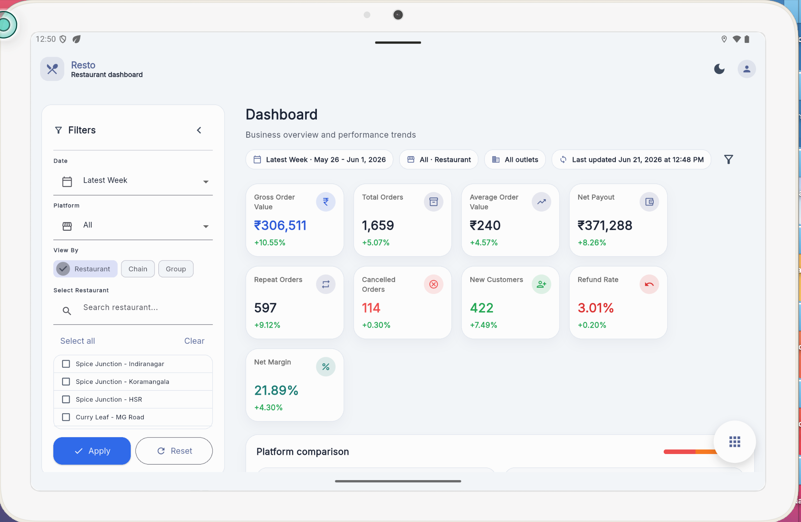
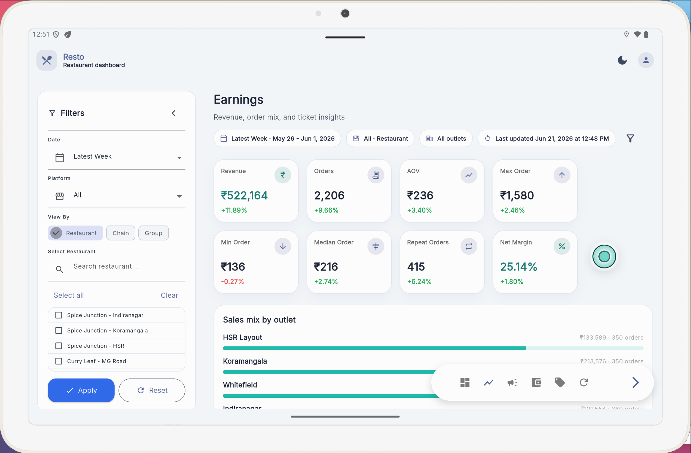
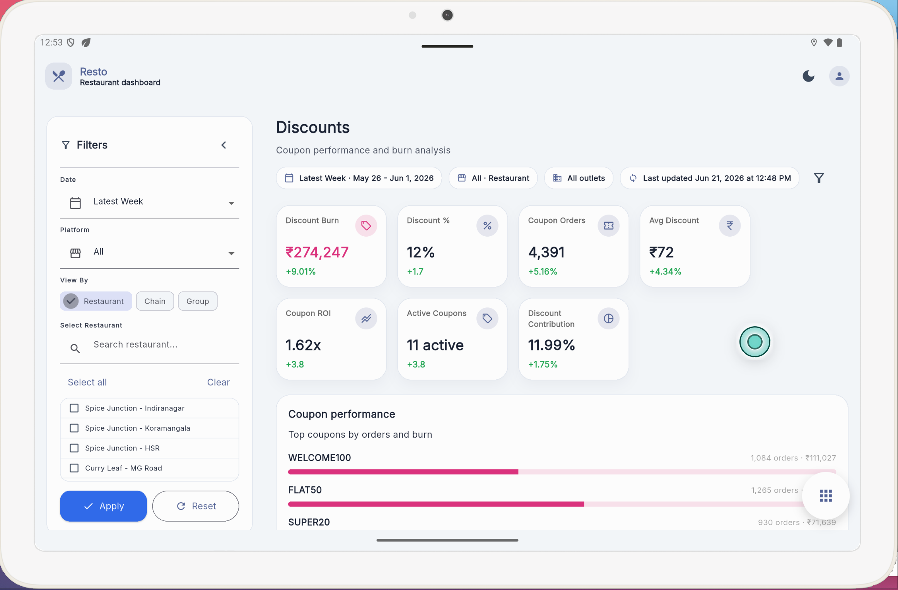
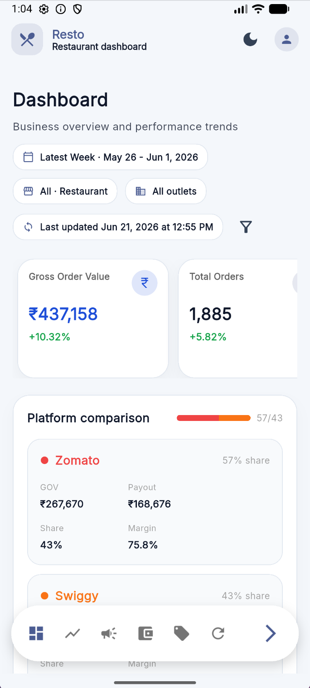

# Resto

Resto is a modern Flutter dashboard for small restaurants to track sales, earnings, ads, discounts, charges, and refunds with clear visualizations and lightweight tools for daily operations.

## Key Features

- Dashboard: real-time KPIs and trend charts
- Earnings analysis: daily/weekly/monthly breakdowns
- Ads & Campaigns: spend and performance views
- Discounts & Coupons: usage and impact tracking
- Charges & Commissions: fee breakdowns
- Refunds & Cancellations: loss and pattern analysis

## Quick Start

Prerequisites:
- Flutter >= 3.11.3
- Xcode (for iOS) / Android SDK (for Android)

Clone and run:
```bash
git clone <repo-url>
cd Resto
flutter pub get
flutter run
```

Run analyzer and tests:
```bash
flutter analyze
flutter test
```

## Building for iOS (release)

1. Ensure a unique bundle identifier is set in `ios/Runner.xcodeproj` (not `com.example.*`).
2. Open `ios/Runner.xcworkspace` in Xcode and set your Development Team under *Signing & Capabilities*.
3. From terminal (recommended):
```bash
flutter build ios --release
```
Or produce an IPA:
```bash
flutter build ipa
```

Notes:
- Use Xcode Organizer or TestFlight to distribute signed builds. For device installs, enable automatic signing and ensure provisioning profiles match the bundle ID.

## Project Structure (overview)

```
lib/
├─ main.dart           # App entry
├─ screens/            # Feature screens (dashboard, earnings, ads...)
├─ widgets/            # Shared UI components and themes
└─ services/           # Networking, persistence, utilities
```

## Dependencies

- fl_chart — charts and visualizations
- google_fonts — typography

See `pubspec.yaml` for exact versions.

## Contributing

1. Fork the repo and create a branch: `git checkout -b feat/your-feature`
2. Implement tests and run `flutter analyze`.
3. Commit, push, and open a PR with a description of changes.

Please follow the existing code style and add changelog notes for notable updates.

## Troubleshooting (common iOS issues)

- Signing errors: ensure the bundle identifier and development team match in Xcode.
- CocoaPods errors: run `cd ios && pod install`.
- Build cache issues: run `flutter clean` then `flutter pub get`.

## License

This project is licensed under the MIT License.

Copyright (c) 2026 Anubhav Sharma

## Contact

For questions or freelance inquiries, contact Anubhav Sharma or open an issue in this repository.

## Screenshots

### Dashboard


### Earnings


### Filters


### Mobile View
